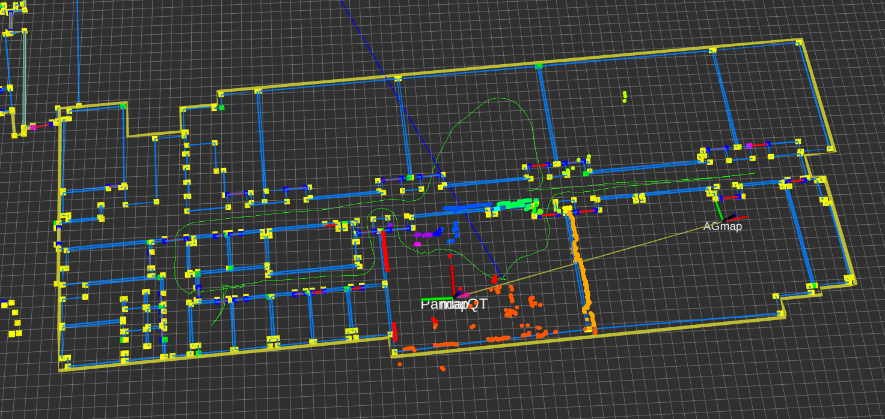

# Localization Using Area Graph

This is a ROS2 package for indoor localization using Area Graphs. it can only be used combined with the AreaGraphDataParser package.



## 1. requirements:

### ROS2 Iron
install dependencies for this package in one step:
```bash
sudo rosdep init
rosdep update
rosdep install --from-paths src --ignore-src -r -y
```

### Third party libraries: ceres & its dependencies:
```bash
sudo apt-get update
sudo apt-get install -y libgoogle-glog-dev libgflags-dev
sudo apt-get install -y libatlas-base-dev
sudo apt-get install -y libeigen3-dev
sudo apt-get install -y libsuitesparse-dev
sudo apt-get install -y libceres-dev
```

## 2. Relation with area_graph_data_parser:

 - osmAG.xml -> area_graph_data_parser -> ROS2 topic: /mapPC_AG, /AG_index -> localization_using_area_graph

## 3. data preparation:
 - an osmAG.xml map file (be parsed by AreaGraphDataParser packages)
 - a point cloud bag file (contains lidar point clouds topic)

## 4. complie and run:
```bash
colcon build --symlink-install --packages-select area_graph_data_parser 
colcon build --symlink-install --packages-select localization_using_area_graph
source install/setup.bash
ros2 launch localization_using_area_graph run.launch.py
```
## 4. output:
 - global robot path published as a ROS2 topic "/RobotPath" estimated by AGLoc system.
